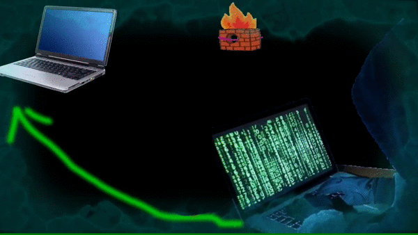

# BlackboxWin
full control of windows operating system using tcp network. 
<a href="https://drive.google.com/file/d/1pfK8nGel-JG5hOXMETchPsyHMDVjij4N/view?usp=sharing">download</a> for the client computer that will be controlled
# what can the controller do?
- fully use the keyboard
- record computer screen
- take a screenshot
- access all storage C:/ "requires verification from client"
- record browser history and bookmarks
- sending message
- open the url in the browser
- shell command

